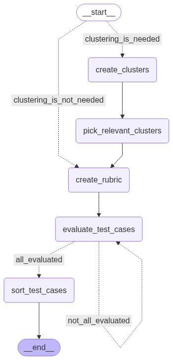

# LangGraph AI Agent with Flask UI

This project is a **LangGraph AI agent** designed for test case analysis and prioritization, with a **simple Flask web UI** for convenient interaction. The AI agent is completely independent from the Flask interface and can be used standalone via command line.

## Overview

The LangGraph AI agent processes test cases and queries to provide intelligent analysis and prioritization. It uses a graph-based workflow to:
- Cluster test cases when needed
- Create evaluation rubrics
- Evaluate and sort test cases by relevance
- Provide prioritized recommendations

### Agent Workflow Visualization



*The above diagram shows the complete workflow of the LangGraph AI agent, including all nodes and their connections.*

## Project Structure

```
src/
├── core/                 # Core components: graph and state
│   ├── graph.py          # Main LangGraph workflow
│   └── state.py          # State definitions
├── nodes/               # Graph nodes (workflow steps)
│   ├── create_clusters.py
│   ├── create_rubric.py
│   ├── evaluate_test_cases.py
│   ├── pick_relevant_clusters.py
│   └── sort_test_cases.py
├── api/                 # External API connection codes
│   ├── llm_client.py     # LLM integration
│   └── tc_file.py        # Test case definitions
└── utils/               # Utility functions that nodes use
    └── parse_llm.py      # LLM response parsing
```

### Folder Descriptions

- **core/**: Contains the main graph definition and state management
- **nodes/**: Individual workflow nodes that make up the LangGraph execution steps
- **api/**: External API connection codes for integrating with LLMs and other services
- **utils/**: Utility functions and helpers that the nodes use for processing

## Usage Options

### Option 1: Web UI (Recommended)

The Flask web interface provides an easy way to interact with the AI agent through your browser.

**1. Start the Flask server:**
```bash
python app.py
```

**2. Open your browser** and navigate to: `http://localhost:5000`

**3. Fill in the form:**
- **Query**: Enter your testing question (e.g., "We updated the URL generation algorithm. What should we test?")
- **Test Cases**: Enter test cases in JSON format or as plain text

**4. Click "Run AI Agent"** to execute the agent with your inputs

### Option 2: Command Line (Standalone)

The AI agent can be run independently without the Flask UI:

```bash
python main.py
```

The agent is completely independent from Flask and uses the same core workflow regardless of how it's invoked.

## Test Cases Format

When using the web UI, you can provide test cases in two ways:

**JSON Format** (recommended):
```json
[
  {
    "id": "1",
    "test_name": "test_basic_functionality",
    "summary": "Test basic functionality works correctly",
    "steps": ["Step 1", "Step 2"],
    "notes": ["Important note"]
  }
]
```

**Plain Text**: The system will automatically convert plain text into a simple test case structure.

## Installation

1. **Install dependencies:**
```bash
pip install -r requirements.txt
```

2. **Set up environment variables** by creating a `.env` file in the project root:
```bash
# .env file
OPENAI_API_KEY=your_openai_api_key_here

# Optional: Langfuse tracing (if you want web-based monitoring)
LANGFUSE_SECRET_KEY=your_langfuse_secret_key_here
LANGFUSE_PUBLIC_KEY=your_langfuse_public_key_here
LANGFUSE_HOST=https://cloud.langfuse.com
```

**Required Environment Variables:**
- `OPENAI_API_KEY`: Your OpenAI API key for LLM integration *(Required)*

**Optional Environment Variables (Langfuse Tracing):**
- `LANGFUSE_SECRET_KEY`: Langfuse secret key for web-based tracing and monitoring
- `LANGFUSE_PUBLIC_KEY`: Langfuse public key for web-based tracing and monitoring  
- `LANGFUSE_HOST`: Langfuse host URL (typically https://cloud.langfuse.com)

> **Note:** Langfuse is **not mandatory**. The agent has extensive CLI logging implemented, so you can trace and monitor the agent execution through console output without Langfuse. If you want to use Langfuse's web-based monitoring, you'll need to create a [Langfuse account](https://langfuse.com) first to get your API keys.

**Optional: Virtual Environment**
If you prefer to use a virtual environment (recommended for isolation):
```bash
python -m venv your-env-name
source your-env-name/bin/activate  # On Windows: your-env-name\Scripts\activate
pip install -r requirements.txt
```
